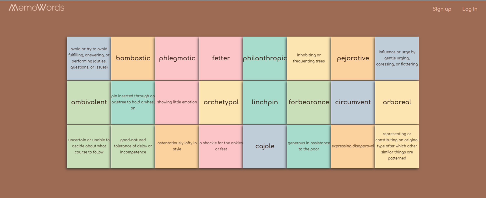

# **MemoWords**

## **Description**

Multi level memory for learning english words

MemoWords was developed using JavaScript as part of the Ironhack developer bootcamp (WebDev-FT-102020) using the "Wordsapi" API.

## **MVP (DOM - CANVAS)**

**Homepage:** will present a mini intro and background to the "purpose" of the game and the setups level to play.

**MemoryGamePage:** Presented with a board of tiles to flip and play "memory". 

**Signup:** A registration form for new users.

**Login:** A sign in form for existing users.

## **Backlog**

**ResultsPage:** A customizable "Results" message with your times
**MemoryGamePage:** Presented for 2 players.

## **Wireframes**

## **Data structure**

__root/

index.htm

memowords.html

login.html

signup.html

__styles/

styleReset.css

style.css

__sripts/

Database.js

Loing.js

Signup.js

User.js

Validator.js

Word.js

wordsAPI.js

wordsmemory.js

__assets/

img/

## **APIs**

https://www.wordsapi.com/

https://rapidapi.com/dpventures/api/wordsapi/

## **Links**

#### Trello 
https://trello.com/b/1Hr64RBj/memowords

#### **Github**
https://github.com/clayrisse/memowords

#### **Slides**
URls for the project presentation (slides) Link Slides.com